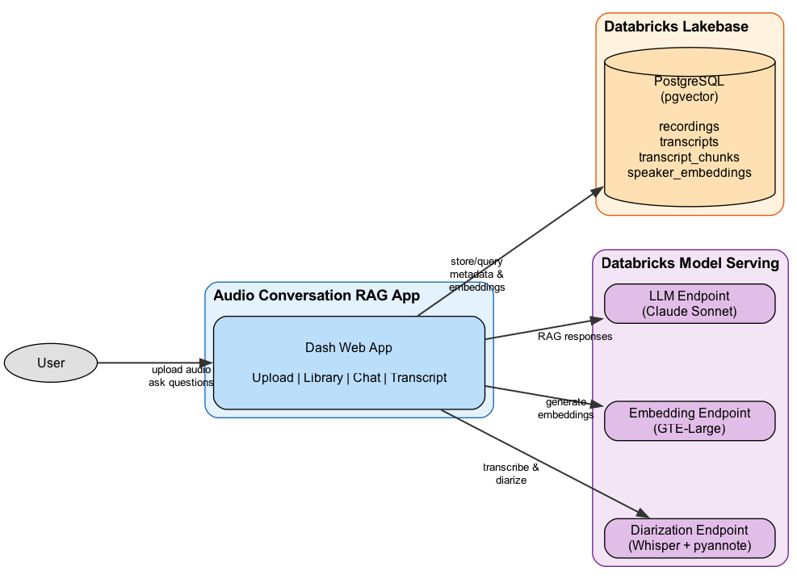

# Audio Conversation RAG System

A Databricks-hosted web application that enables teams to upload audio recordings of customer conversations, process them through speaker diarization and transcription, and interact with the content through a conversational AI interface.

## Architecture



## Features

- **Audio Upload**: Drag-and-drop support for MP3, WAV, M4A, and FLAC files (up to 500MB)
- **Speaker Diarization**: Automatic identification and labeling of different speakers
- **Transcription**: High-quality speech-to-text using Whisper
- **Conversational Search**: Ask questions about your recordings and get answers with source citations
- **Transcript Viewer**: Browse full transcripts with speaker labels and keyword search

## Prerequisites

- Python 3.11+
- [uv](https://github.com/astral-sh/uv) package manager
- [Databricks CLI](https://docs.databricks.com/en/dev-tools/cli/install.html) configured with authentication
- Access to a Databricks workspace with:
  - Unity Catalog enabled
  - Model Serving capabilities
  - Lakebase Postgres Autoscaling enabled (Public Preview)

## Setup

### 1. Deploy the Diarization Model

The diarization model uses Whisper for transcription and Pyannote for speaker identification.

#### Prerequisites for Model Deployment

1. **Hugging Face Access Token**: Create a Databricks secret containing your Hugging Face token:
   ```bash
   databricks secrets put-secret <scope> <key>
   ```

2. **Pyannote Model Access**: Accept the usage agreements on Hugging Face for:
   - [pyannote/speaker-diarization-3.1](https://huggingface.co/pyannote/speaker-diarization-3.1)
   - [pyannote/segmentation-3.0](https://huggingface.co/pyannote/segmentation-3.0)
   - [pyannote/speaker-diarization-community-1](https://huggingface.co/pyannote/speaker-diarization-community-1)
   - [pyannote/embedding](https://huggingface.co/pyannote/embedding)

#### Deploy the Model

1. Deploy the bundle `make bundle-deploy` to upload the notebook into Databricks.

2. Open the notebook in Databricks: `~/.bundle/audio_diarization_demo`

3. Configure the widget parameters:
   - `catalog`: Unity Catalog name (e.g., `my_catalog`)
   - `schema`: Schema name (e.g., `default`)
   - `volume`: Volume for audio files (e.g., `audio_recordings`)
   - `audio_path`: Test audio file path (optional)
   - `secret_scope`: Databricks secret scope containing HF token
   - `secret_name`: Secret key name for HF token

4. Run all cells. The notebook will:
   - Install dependencies
   - Create the catalog, schema, and volume if they don't exist
   - Register the PyFunc model to Unity Catalog
   - Deploy a GPU-powered serving endpoint (`audio-transcription-diarization-endpoint`)

5. Wait for the serving endpoint to become active (this can take several minutes).

### 2. Create the PostgreSQL Database (Lakebase)

The application uses Databricks Lakebase Postgres with the pgvector extension for vector storage. Lakebase provides a fully managed PostgreSQL database with autoscaling compute, scale-to-zero capability, and database branching.

#### Enable Lakebase

If "Lakebase Postgres Autoscaling" isn't visible in your workspace, ask a workspace admin to enable it through **Admin Settings > Preview features**.

#### Create a Lakebase Project

1. Launch the **Lakebase App** using the apps switcher in Databricks

2. Click **New project** and provide a project name

3. Select your preferred Postgres version

4. The system automatically creates:
   - A `main` branch
   - A default `databricks_postgres` database
   - Compute resources in your workspace region

5. Wait for compute to become active

#### Connect and Configure

1. From your project, select the `main` branch and click **Connect**

2. Choose your authentication method:
   - **OAuth**: Use your Databricks identity
   - **Native Postgres role**: Create a username/password for application access

3. Note the connection endpoint (e.g., `ep-xxxxx.database.us-east-1.cloud.databricks.com`)

4. Store your database credentials as Databricks secrets:
   ```bash
   databricks secrets put-secret <scope> pg-user
   databricks secrets put-secret <scope> pg-password
   ```

### 3. Configure the Databricks App

The application runs as a Databricks App, configured via `app.yaml`. Update this file with your environment-specific values:

```yaml
command:
  - /bin/bash
  - -c
  - PYTHONPATH=/app/python/source_code python src/app.py

env:
  # PostgreSQL (Lakebase) connection
  - name: POSTGRES_HOST
    value: ep-xxxxx.database.us-east-1.cloud.databricks.com  # Your Lakebase endpoint
  - name: POSTGRES_PORT
    value: '5432'
  - name: POSTGRES_USER
    valueFrom: pg-user        # References secret defined in resources/data.app.yml
  - name: POSTGRES_PASSWORD
    valueFrom: pg-password    # References secret defined in resources/data.app.yml
  - name: POSTGRES_DB
    value: databricks_postgres

  # UC Volume for audio file storage
  - name: VOLUME_PATH
    value: /Volumes/your_catalog/your_schema/audio_recordings

  # Databricks workspace
  - name: DATABRICKS_HOST
    value: https://your-workspace.cloud.databricks.com

  # Serving endpoint for audio diarization
  - name: DIARIZATION_ENDPOINT
    value: audio-transcription-diarization-endpoint

  # RAG configuration
  - name: SIMILARITY_TOP_K
    value: '5'
  - name: SIMILARITY_THRESHOLD
    value: '0.7'

  # Processing settings
  - name: ENABLE_AUDIO_CHUNKING
    value: 'false'
  - name: DIARIZATION_TIMEOUT_SECONDS
    value: '900'
```

#### Configure App Resources

Update `resources/data.app.yml` with your secret scope and serving endpoint names:

```yaml
resources:
  apps:
    data_app:
      name: "your-app-name"
      source_code_path: ..
      description: "Audio diarization and conversational RAG application"
      resources:
        - name: pg-user
          secret:
            scope: your-secret-scope
            key: pg-user
            permission: READ
        - name: pg-password
          secret:
            scope: your-secret-scope
            key: pg-password
            permission: READ
        - name: diarization-endpoint
          serving_endpoint:
            name: audio-transcription-diarization-endpoint
            permission: CAN_QUERY
        - name: llm-endpoint
          serving_endpoint:
            name: databricks-claude-sonnet-4-5
            permission: CAN_QUERY
        - name: embedding-endpoint
          serving_endpoint:
            name: databricks-gte-large-en
            permission: CAN_QUERY
```

### 4. Configure the Asset Bundle

Update `databricks.yml` with your workspace:

```yaml
bundle:
  name: audio_diarization_demo

include:
  - resources/*.yml

targets:
  dev:
    mode: development
    workspace:
      host: https://your-workspace.cloud.databricks.com
```

### 5. Deploy the Application

Run the full deployment:
```bash
make deploy
```

This command will:
1. Deploy the Databricks asset bundle
2. Run database migrations (creates tables and enables pgvector)
3. Start the app compute if not running
4. Deploy the application source code

Alternatively, run individual steps:
```bash
make bundle-deploy    # Deploy the asset bundle only
make migrate          # Run database migrations
make app-start        # Start app compute
make app-deploy       # Deploy source code
```

## Development

### Local Development Setup

For local development, create a `.env` file in the project root:

```env
POSTGRES_HOST=ep-xxxxx.database.us-east-1.cloud.databricks.com
POSTGRES_PORT=5432
POSTGRES_USER=your-username
POSTGRES_PASSWORD=your-password
POSTGRES_DB=databricks_postgres
DATABRICKS_HOST=https://your-workspace.cloud.databricks.com
VOLUME_PATH=/Volumes/your_catalog/your_schema/audio_recordings
DIARIZATION_ENDPOINT=audio-transcription-diarization-endpoint
LLM_ENDPOINT=databricks-claude-sonnet-4-5
EMBEDDING_ENDPOINT=databricks-gte-large-en
SIMILARITY_TOP_K=5
SIMILARITY_THRESHOLD=0.7
ENABLE_AUDIO_CHUNKING=false
DIARIZATION_TIMEOUT_SECONDS=900
```

### Install Dependencies

```bash
make install
```

### Run Locally

```bash
make run
```

The app will be available at `http://localhost:8050`.

### Run Tests

```bash
make test              # All tests
make test-unit         # Unit tests only
make test-integration  # Integration tests only
```

### Code Quality

```bash
make lint    # Check code style
make format  # Auto-format code
```

### Database Migrations

```bash
make migrate                          # Apply migrations
make migrate-new MSG='description'    # Create new migration
```

## Project Structure

```
.
├── src/
│   ├── app.py                    # Main Dash application
│   ├── config.py                 # Configuration management
│   ├── models/                   # SQLAlchemy models
│   ├── components/               # Dash UI components
│   ├── services/                 # Business logic
│   └── db/                       # Database session management
├── alembic/                      # Database migrations
├── notebooks/                    # Databricks notebooks
│   └── audio_diarization_pyfunc.py
├── resources/                    # DAB resource definitions
├── tests/
├── app.yaml                      # Databricks app config
├── databricks.yml                # Asset bundle config
├── pyproject.toml
├── requirements.txt
└── Makefile
```

## Usage

1. **Upload**: Navigate to the Upload tab and drag-and-drop an audio file
2. **Process**: The system automatically transcribes and diarizes the audio
3. **Browse**: View all recordings in the Library tab
4. **View Transcript**: Click a recording to see the full transcript with speaker labels
5. **Chat**: Use the Chat tab to ask questions about your recordings

## Troubleshooting

### Model Serving Endpoint Not Responding

- Ensure the endpoint is in "Ready" state in the Serving UI
- Check that `HF_AUTH_TOKEN` environment variable is set correctly on the endpoint
- Verify GPU workload size is sufficient (GPU_MEDIUM recommended)

### Database Connection Issues

- Verify Lakebase compute is active (not scaled to zero)
- Ensure secrets are correctly configured in Databricks

### Audio Processing Fails

- Check file format is supported (MP3, WAV, M4A, FLAC)
- Ensure file size is under 500MB
- Review error message in the Library tab for specific issues

## License

Databricks Licence
